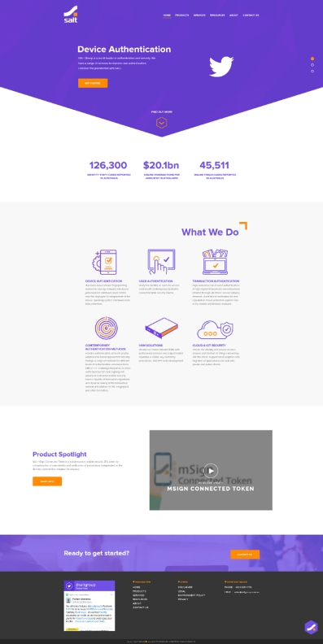

# Salt

## Описание

[Демо](https://egarnaga.github.io/salt/main.html)

* **Стандарты вёрстки:** HTML5, CSS3, прогрессивное улучшение.
* **Сетка:** определена в макете.
* **Раскладка блоков на странице** делается с помощью Flexbox.
* **Адаптивность сетки:** мобильная, планшетная и десктопная версии. 
* **Desktop First.** На всех промежуточных разрешениях используется резиновая вёрстка.
* **Используемая методология:** БЭМ.
* **Используемый препроцессор:** Sass (SCSS).
* **Используемые инструменты автоматизации:** Webpack, Gulp.
* **Кроссбраузерность:** Chrome, Firefox, Safari, Edge, Internet Explorer 11.
* **Макет** предоставляется в Photoshop.
* **Нестандартные шрифты** подключены локально.
* **JavaScript:** Vanilla JS, jQuery, swiper.js
* **Прочее:**  вёрстка сделана Pixel Perfect, выполнена ретинизация растровой графики, оптимизация и улучшение доступности.

## Превью

## Краткая инструкция по работе
Для начала работы у вас должент быть установлен **Node.js**

### Основные команды для работы
- Установка - `npm i`
- Запуск локального сервера - `npm start`
- Сборка проекта без запуска локального сервера - `npm run build`

### Вся разработка ведётся в директории `source`
### Итоговый код попадает в директорию `build`
